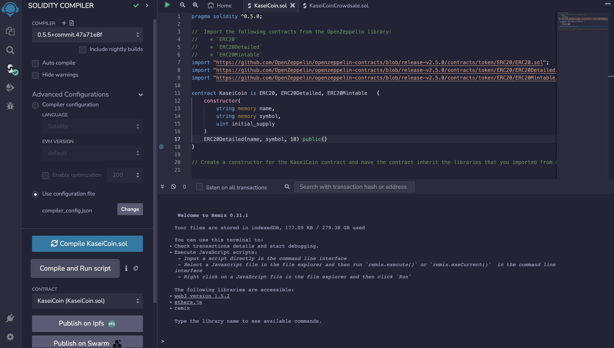

# Unit 21: Martian Token Crowdsale

## Background

After waiting for years and passing several tests, the Martian Aerospace Agency selected you to become part of the first human colony on Mars. As a prominent fintech professional, they chose you to lead a project developing a monetary system for the new Mars colony. You decided to base this new system on blockchain technology and to define a new cryptocurrency named **KaseiCoin**. (Kasei means Mars in Japanese.)

KaseiCoin will be a fungible token that’s ERC-20 compliant. You’ll launch a crowdsale that will allow people who are moving to Mars to convert their earthling money to KaseiCoin.

 
 

## **Evaluation Evidence**

 

After writing the code on Ethereum Remix, I compiled the contracts. I also added a third contract, as some of the code needed to be split up.

 

- ### **KaseiCoin.sol Compiled**

- 

- ### **KaseiCoinCrowdsale.sol Compiled**

- 

- ### **Deployer.sol Compiled**

- 

 
 

Next, I connected my Ganache wallet to my Metamask account by creating a "Ganache Network" and providing the private key to my local Ganache Address.

- 

 

- 

 

- 

Next, I changed the environment to MetaMask, and added the values for name, symbol, and wallet. Then, I deployed the "Deployer.sol" contract, at first keeping Wei at 0 just to confirm it would work. After confirming the successful deployment through my metamask and ganache, I changed the Wei value from 0 to 5, and again confirmed that the transaction was successful.

 
 

- The contract section shows a different file name (I changed it later), but it is still the exact same code. 

- 

- 

- 

Once I completed the transaction, there is a small difference in the amount of Ethereum present in my Metamask wallet.

- 
